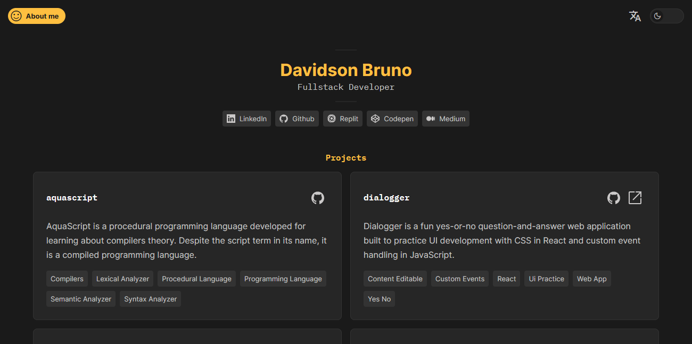

# davidsonbruno.dev

  

[[Ver em Português](README.pt-br.md)]

**davidsonbruno.dev** is a portfolio website by software developer Davidson Bruno that brings together his main projects and posts on the internet. The objective of davidsonbruno.dev is to be a centralized space for publicizing your creations.

All design and project components were designed and drawn in Figma ([see here](https://www.figma.com/file/eaxqnjsiNKu9GrsKiyFMI6/davidsonbruno.dev?node-id=0%3A1&t=yiS8Dayzap2k4rA1-1)) and built with Vue.JS and Pure CSS with Sass as preprocessor.

The website content is currently available in Portuguese and English. There is also option for dark and light mode.

## Contact

Feel free to send an email to <davidsonbruno@outlook.com>.

## License

[MIT](LICENSE.md) Copyright (c) 2023, Davidson Bruno.
