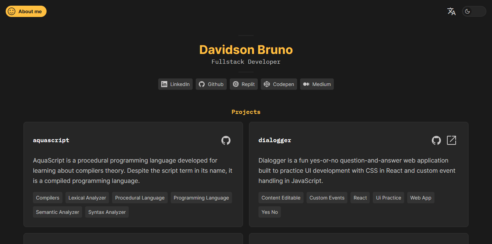

# davidsonbruno.dev

  

[[See in English](README.md)]

**davidsonbruno.dev** é um website de portfólio do desenvolvedor de software Davidson Bruno que reúne seus principais projetos e postagens na internet. O objetivo de davidsonbruno.dev é ser um espaço centralizado para divulgação de suas criações públicas.

Todo o design e componentes do projeto foram projetados e desenhados no Figma ([veja aqui](https://www.figma.com/file/eaxqnjsiNKu9GrsKiyFMI6/davidsonbruno.dev?node-id=0%3A1&t=yiS8Dayzap2k4rA1-1)) e construídos com Vue.JS e CSS Puro com Sass como pré-processador.

O conteúdo do website está disponível atualmente em português e inglês. Também há opção para modo escuro e claro.

## Contato

Fique à vontade para enviar um e-mail para <davidsonbruno@outlook.com>.

## Licença

[MIT](LICENSE.md) Copyright (c) 2023, Davidson Bruno.
